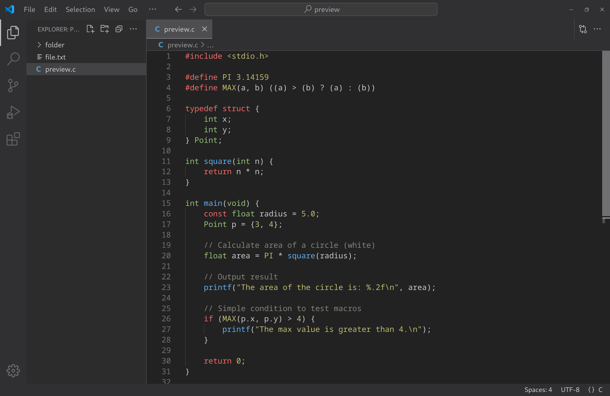

# minimal

minimal theme for vscode

 

 

### Color scheme

#### IDE colors

| Color   | Hex Code  | element                                   |
|---------|-----------|-------------------------------------------|
| dark grey | `#222222` | editor background                        |
| medium grey | `#2c2c2d` | sidebar background                     |
| light grey | `#303032` | other elements background               |

#### Syntax highlighting

| Color   | Hex Code  | Usage                                     |
|---------|-----------|-------------------------------------------|
| red     | `#f76a6a` | keywords, markdown titles                 |
| green   | `#98c379` | types                                     |
| blue    | `#61afef` | function declarations and calls           |
| orange  | `#bfbb71` | constants, strings, macros, JSON values   |
| grey    | `#85857a` | comments                                  |
| white   | `#cccccc` | all other elements                        |
